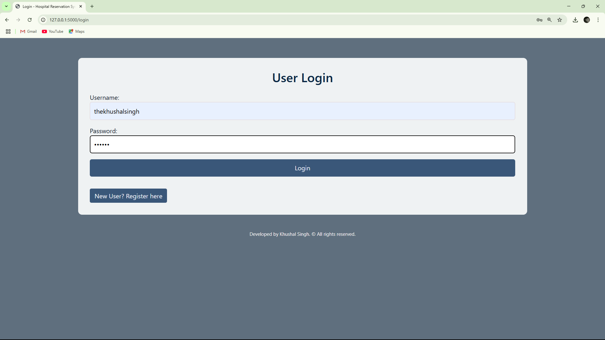
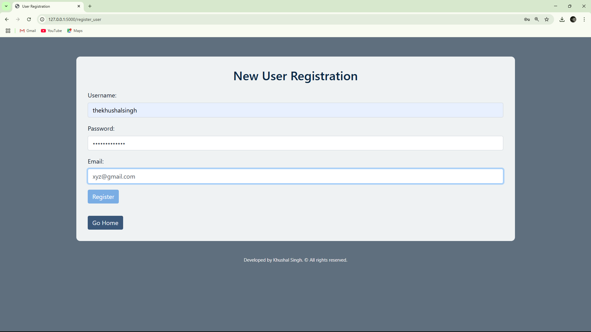
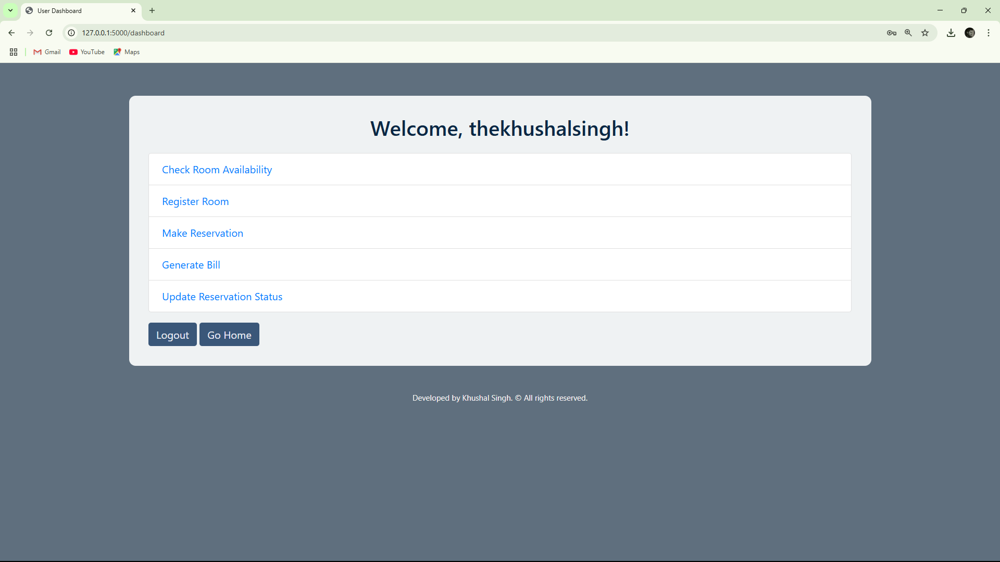
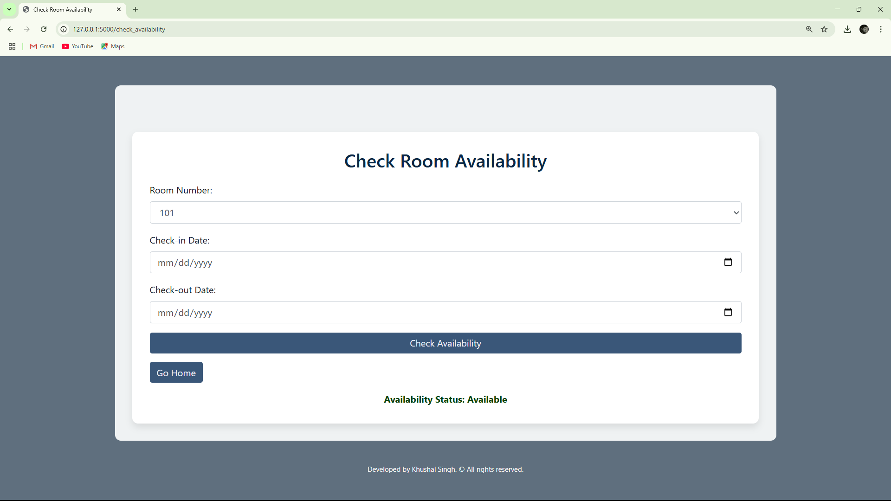
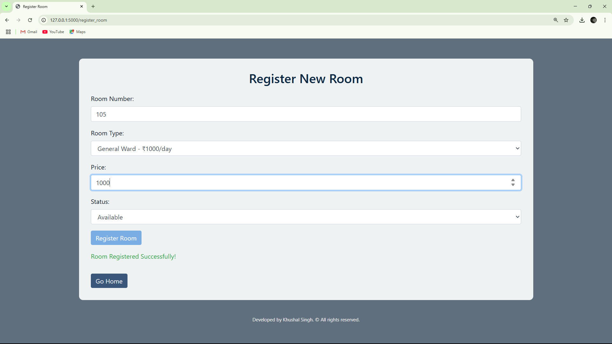
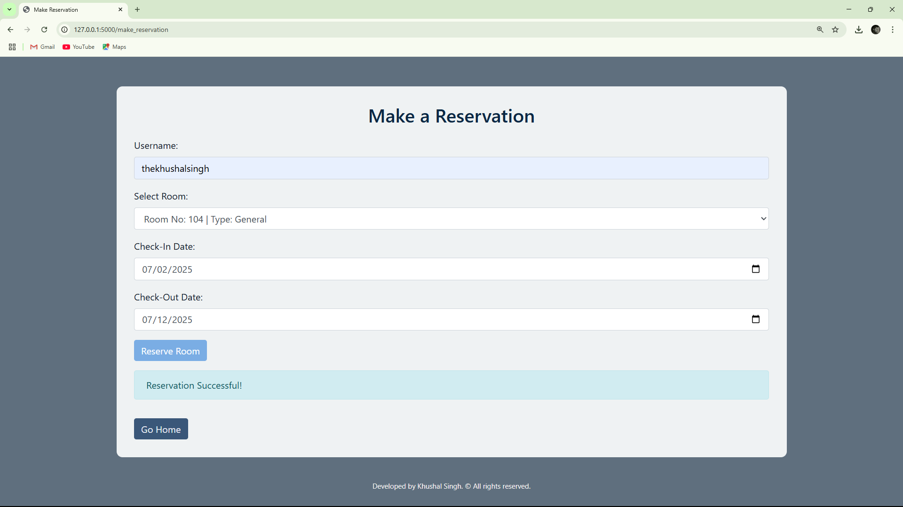
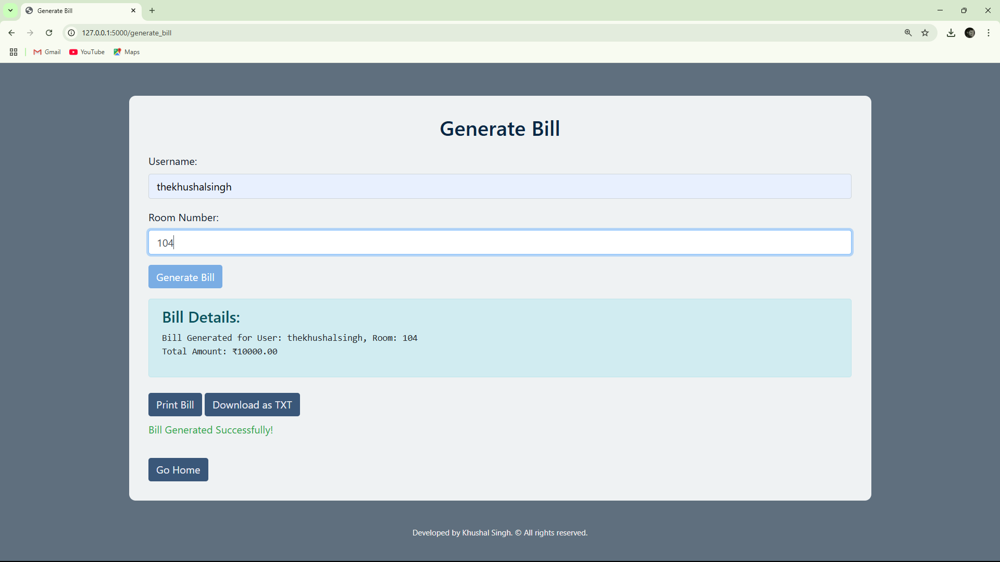
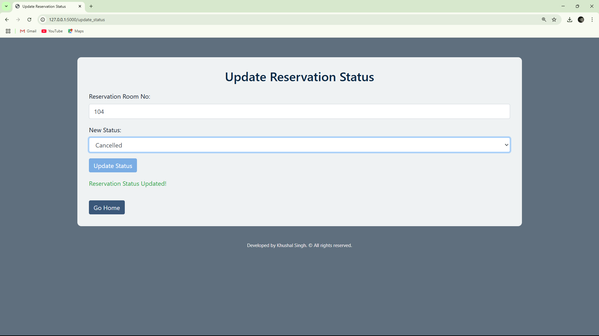

# 🏥 Hospital Room Availability Checking during Reservation


---

## 📌 Project Overview:

This is a **Flask-based web application with an SQL Server database**, designed for **hospital room management and reservation tracking**.

It enables hospital staff to:

- ✅ Check room availability based on room number and dates  
- ✅ Register new rooms with different types and price categories  
- ✅ Manage user registrations and logins  
- ✅ Make room reservations  
- ✅ Generate and print/download bills  
- ✅ Update reservation status (e.g., Check-In / Check-Out)  

---

## ✅ Features:

| Module | Description |
|---|---|
| 🧑‍💻 User Login | Secure login for hospital staff |
| 🆕 New User Registration | Register new staff users |
| 🏨 Room Registration | Register rooms with type and price |
| ✅ Check Availability | Check room availability by room number and dates |
| 📅 Make Reservation | Create new room bookings |
| 💳 Generate Bill | Generate, view, print, and download customer bills |
| 🔄 Update Status | Change reservation status (Check-In, Check-Out, etc.) |

---

## 🛠️ Technologies Used:

- Python Flask
- SQL Server
- HTML5 + Jinja2
- Bootstrap 4 + Custom CSS
- Gunicorn (For deployment)

---

## 📂 Project Folder Structure:

```
HospitalRoomReservation/
├── app.py
├── requirements.txt
├── Procfile
├── hospital_reservation.db
├── hospital_reservation_sqlite.sql
├── static/
│    └── style.css
├── templates/
│    ├── index.html
│    ├── login.html
│    ├── register_user.html
│    ├── dashboard.html
│    ├── check_availability.html
│    ├── register_room.html
│    ├── make_reservation.html
│    ├── generate_bill.html
│    └── update_status.html
├── screenshots/
│    ├── login.png
│    ├── register_user.png
│    ├── dashboard.png
│    ├── check_availability.png
│    ├── register_room.png
│    ├── make_reservation.png
│    ├── generate_bill.png
│    └── update_status.png
└── README.md
```

---

## ✅ Screenshots:

### 🔐 Login Page:



---

### 👤 User Registration:



---

### 🏠 Dashboard (Post Login):



---

### ✅ Check Room Availability:



---

### 🏨 Register New Room:



---

### 📅 Make Reservation:



---

### 💳 Generate Bill (Download/Print Enabled):



---

### 🔄 Update Reservation Status:



---

## ✅ Running the Project Locally:

```bash
# 1. Optional: Create virtual environment
python -m venv venv
venv\Scripts\activate   # (For Windows)

# 2. Install required packages
pip install -r requirements.txt

# 3. Create SQL Server database
sql sever hospital_reservation.db < hospital_reservation_s.sql

# 4. Run the Flask App
python app.py
```

Access the app at:

```
http://127.0.0.1:5000/
```


---

## ✅ Notes:

- This project is for **educational/demo purposes**.
- SQL Server is used for ease of deployment.
- Styling and UI use **Bootstrap 4 + custom CSS**.


---

## ✅ Developed By:

**Khushal Singh**  
> **© 2025 All rights reserved**
